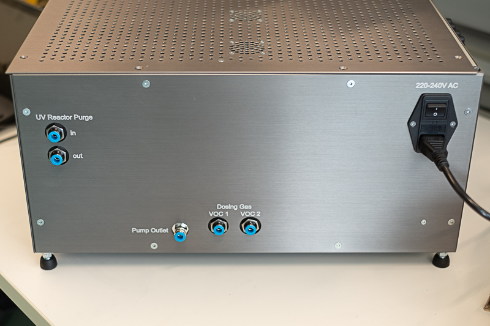
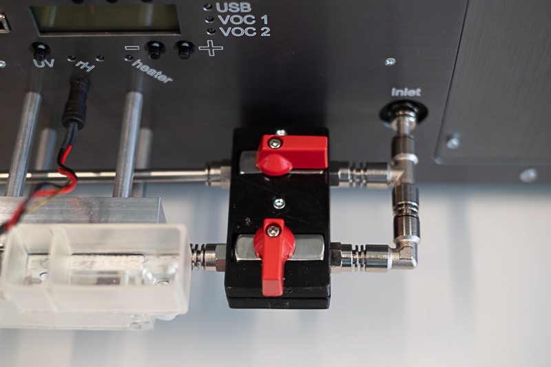
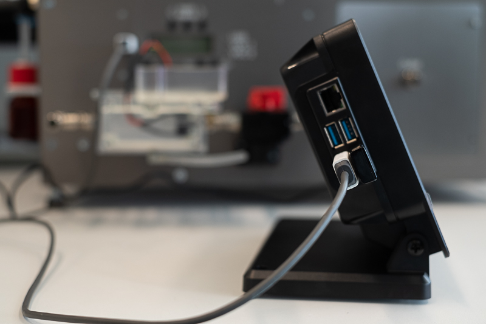
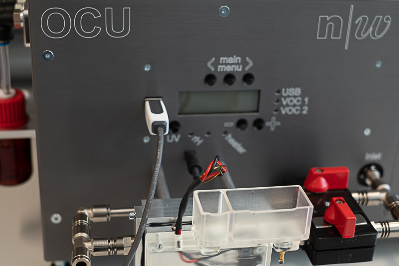
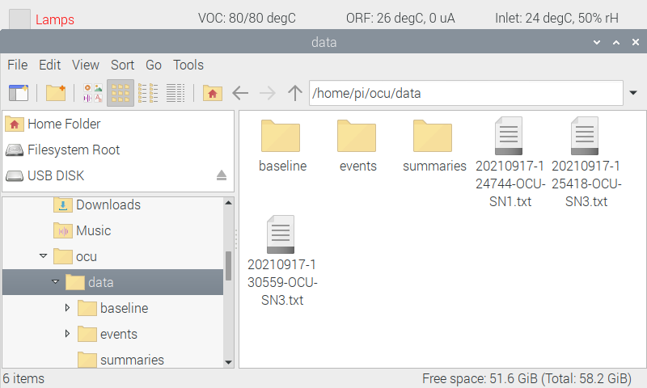
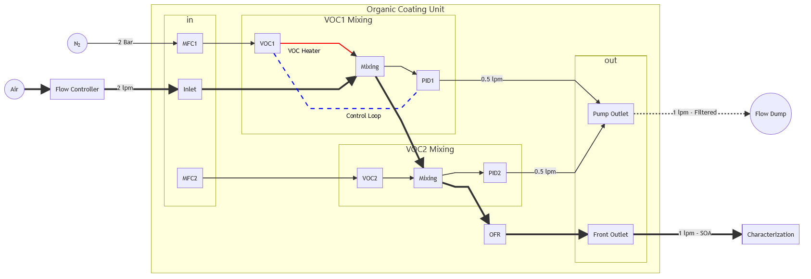
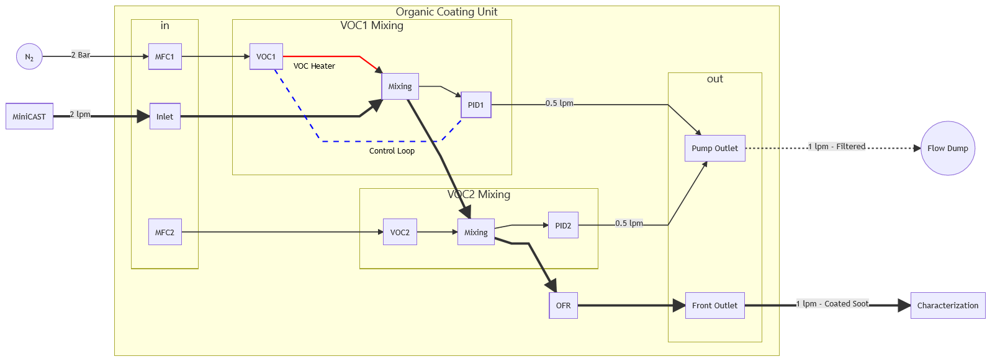
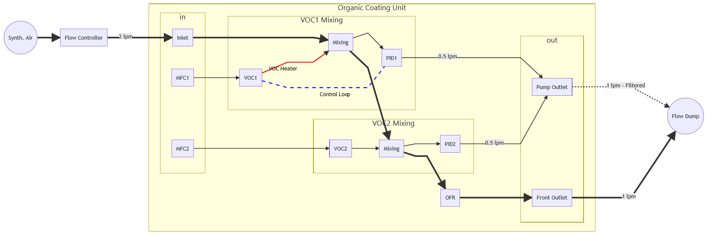
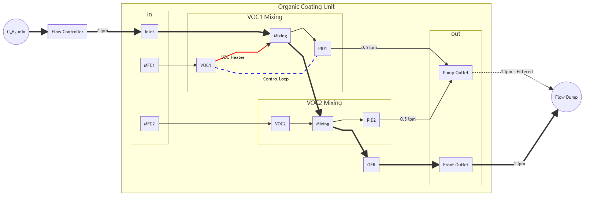

# Organic Coating Unit Operating Manual

## Table of contents

- [Introduction](#introduction)
  * [Inside diagram and components section will be inserted here](#inside-diagram-and-components-section-will-be-inserted-here)
- [Preparing the OCU for operation](#preparing-the-ocu-for-operation)
    + [Additional Material](#additional-material)
  * [1. Purging the oxidation flow reactor](#1-purging-the-oxidation-flow-reactor)
  * [2. Gas for VOC dosing](#2-gas-for-voc-dosing)
  * [3. VOC precursor](#3-voc-precursor)
  * [4. Humidifier](#4-humidifier)
  * [5. Connecting the microcomputer](#5-connecting-the-microcomputer)
  * [6. Configuring the microcomputer](#6-configuring-the-microcomputer)
- [Using the System](#using-the-system)
  * [The Graphical user interface](#the-graphical-user-interface)
    + [1. The button section](#1-the-button-section)
    + [2. Set-points section](#2-set-points-section)
    + [3. OCU Status](#3-ocu-status)
    + [4. Photoionization Detector Voltage](#4-photoionization-detector-voltage)
    + [5. VOC Flow](#5-voc-flow)
  * [Serial Commands](#serial-commands)
  * [Accessing the log files](#accessing-the-log-files)
- [Frontpanel operation](#frontpanel-operation)
- [Experimental Setup](#experimental-setup)
  * [Generation of Pure Secondary Organic Matter Particles by Homogeneous Nucleation](#generation-of-pure-secondary-organic-matter-particles-by-homogeneous-nucleation)
  * [Coating of Particles with Secondary Organic Matter](#coating-of-particles-with-secondary-organic-matter)
  * [Calibrating the photoionization detector (PID)](#calibrating-the-photoionization-detector-pid)
    + [Baseline](#baseline)
    + [Signal span](#signal-span)
- [Mantainance](#mantainance)
  * [PID Sensors](#pid-sensors)
  * [Changing the particle filters](#changing-the-particle-filters)
  * [OFR UV Lamp replacement](#ofr-uv-lamp-replacement)
- [Useful links](#useful-links)

# Introduction

There is a need for well-defined reference aerosols generated in the laboratory, simulating properties of real ambient aerosols while being stable and reproducible. Ambient aerosols are mixtures of fresh and aged products. Atmospheric photochemical aging influences both physical and chemical properties and should be considered for complex studies as well as everyday applications. Within the framework of the EMPIR AeroTox project, we developed the organic coating unit. This instrument is a novel portable aerosol generator equipped with a humidifier, a precursor dosing system and specially designed oxidation flow reactor (OFR). Using the OCU you will be able to generate pure secondary organic matter (SOM) particles or, used in combination with a standard soot generator, particles consisting of a soot core coated with SOM. Other type of particles can also be coated with SOM using this device.

This guide will take you through the necessary steps for the production of secondary organic matter (SOM) aerosol. The physical and chemical properties of the generated particles can be tuned in a simple manner by selecting target values for parameters, such as precursor concentration, humidity, and UV light intensity to simulate a wide range of atmospherically relevant carbonaceous aerosols. Applications include instrument calibration, filter testing, and health and climate studies. 

This document is ongoing and will be updated regularly. Please feel free to contribute with content, questions, or new section requests. We wish a successful deployment of the instrument in your experimental campaigns.

||
|:--:|
|*Watch the short virtual poster presentation for the ETH Zurich Nanoparticle Conference 2021*|
|| 
|*Front view of the organic coating unit, showing the control panel, inlet, humidifier and outlet. The VOC bottles are located on the left side of the device.*|
||
|*Back view of the organic coating unit, showing the different gas connectors.*|

## Inside diagram and components section will be inserted here

# Preparing the OCU for operation

### Additional Material

1. Precursor VOC (e.g. α-pinene)
2. High purity VOC-Free Synthetic air (e.g., Carbagas ALPHAGAZ™ 1)
3. Flow controller capable of delivering 2 lpm (e.g., Mass flow controller, critical orifice, etc.)
4. Recommended: Innert gas (e.g. N2) for purging of the oxidation flow reactor
5. Recommended: Festo blanking plugs for 6mm outer diameter tube (part Nr. QSC-6H)
6. Recommended: Reference isobutylene (C4H8) gas mixture (e.g. 100 ppm Isobutylene, synthetic air rest) for calibration purposes.
7. Optional: Ultra pure water (e.g. Milli-Q) for humidity experiments

## 1. Purging the oxidation flow reactor

The oxidation flow reactor consist of a UV-grade quartz tube surrounded by 5 mercury lamps. The reactor can be purged with an oxigen free gas, like N2, to avoid the formation of ozone outside of the reaction area. The purge inlet is located at the back of the OCU. It is enough to apply a low flow (e.g. 1 lpm) for 60 seconds in order to fill the reactor with the innert gas. The OCU is equipped with backflow prevention valves in order to keep the innert gas in the reactor. This opperation can be performed once a week.

||
|:--:| 
|*Inlet for purging the oxidation flow reactor of the OCU. This procedure avoids the formation of ozone outside of the reaction area. Backflow prevention valves keep the innert gas in the reactor area for several days.*|

## 2. Gas for VOC dosing

The OCU is equiped with two connectors for the VOC carrier gas. This way, it is possible to choose different gases for the two dosing systems or use, e.g., a premixed NO2 mixture for the second dosing loop. The VOC1 and VOC2 connectors correspond to the gas delivery system for the VOC bottles marked with those names at the left side of the device. **The required pressure for those connectors is 2 Bars**. A different pressure may cause an incorrect reading of the flow dupplied by the mass flow controllers inside the OCU. Inlets that are not in use should be closed with a  blanking plug. Failure to do so can result in leackage and contamination of the sample.

||
|:--:| 
|*Connection of the carrier gas for the VOC1. The VOC2 can supplied with the same carrier gas or an alternative gas mixture. Keeped unused connectors closed using a blanking plug to avoid contamination of the sample.*| 

## 3. VOC precursor

Use the supplied 25ml bottles to for the VOC precursor. Typically, 5ml of liquid will allow for several hours of operation. We do not recommend using more than 10ml.  If one of the dosing bottles is missing, the corresponding inlet should be closed with a blanking plug.

**Important: The tube inside the bottle should never be bellow the liquid level.**

Note: The volatility of the precursor and the room temperature will determine the maximum and minimum achievable dosing concentration. Low volatility precursors, for instance substances that are solid at room temperature, require heating of the bottle, while very volatile substances may require active cooling. We are working towards a standarized solution for those special cases.

||
|:--:| 
|*Bottle for VOC precursor at the left side of the OCU. Avoid overfilling the bottle, 5ml of liquid will usually allow for several hours of operation. Also be sure to close the VOC inlets that are not being used by means of a blanking plug.*| 

## 4. Humidifier

The humidifier located in front of the device provides a practical and reproducible moisture control. This help to switch the main oxidation path from ozone oxidation, when using dry air as a carrier gas, to a mixture of ozone and hydroxile oxidation when using humidified air. The following images will guide you through the steps for to prepare the humidifier for ozone/hydroxile experiments.

||
|:--:| 
|1. Start by making sure that the humidifier is plugged to the control panel using the round connector.|
||
|2. Fill large section (right) of the humidifier tank with high purity water, like Milli-Q water. As you fill the tank, the connecting tube will fill the humidifier and the smaller tank on the left side. This procedure prevents the formation of air bubbles. Make sure the tube is connected to both tanks before starting to pour water. During the experiemnt, the transparent material of the tank will help you to monitor water consumption during the experiment. Refill as necesary.|
||
|3a. **Dry operation mode:** Front valve closed and back valve open. If the tank is full of water, avoiding the front part is the only way to keep the carrier gas dry.|
||
|3b. **Humidity control mode:** Front valve open and back valve closed. The minimum and maximum achievable humidity depend on factors like flow rate and room temperature. The set point for the relative humidity can be selected later using the graphical user interface on the microcomputer.|
||
|4. Never leave the water tank filled with water when the instrument is not in use. This will prevent condensation of water on the tubes. Empty the tank by disconnecting the tube from one of the tanks. Use a small container on the bottom to collect the water.|

## 5. Connecting the microcomputer

You are almost there, the final step is to connect the microcomputer to the OCU. Use a USB cable to connect one of the microcomputer's USB ports to the front pannel of the OCU. There is no switch on the microcomputer, it will be turned on when connecting the USB power supply. Once the microcomputer is on, the user interface will start as soon as the OCU is turned on. It is also possible to turn the OCU before the microcomputer. You will need to restart the microcomputer if the OCU is turned off and back on. 

Anytime you can press the <kbd>Windows</kbd>-key to access the start menu of the operating system or <kbd>Alt</kbd> + <kbd>F11</kbd> to toggle the GUI between maximized and window-view mode.

Note: The OCU has a touch screen but it is easier to operate using a keyboard and a mouse (not supplied).

||
|:--:| 
|*USB connectors at the microcomputer. Also keyboard and a mouse can be connected here as an alternative to the touch screen.*|
||
|*USB connector at the OCU for the microcomputer*|
||
|*Microcomputer power supply. Always use the supplied power supply or a 15 Watt supply compatible with a raspberry pi 4.*|

## 6. Configuring the microcomputer

The microcomputer is a raspberry pi model 4. It runs on the Linux-based Raspbian operating system. The python based software for control and data logging is preinstalled on the device, and is configured for an automatic start when the OCU and the microcomputer are connected. The microcomputer clock needs to be synchronized for a correct timestamp on the logfile. This can be performed automatically by setting the correct time zone and configuring the network access[^2]. Make sure that the Network Time Protocol (NTP) port, i.e. port number 123, is allowed by your firewall. Alternativally, the clock can be set manually through the command line using the `date` command (e.g. `sudo date -s 'YYYY-MM-DD HH:MM:SS'`). A manual configuration needs to be performed on a daily bases, because the Raspberry Pi is not equiped with a real time clock. The command line is accesible at any moment using the key combination <kbd>Ctrl</kbd>+<kbd>Alt</kbd>+<kbd>t</kbd>.

For your convinience, the microcomputer can also be accessed as a remote desktop from another computer. The most straightforward way is to activate the VNC software[^7], which comes preinstalled on the the Raspberry Pi OS.

Further configuration of the microcomputer can be performed following the Raspberry Pi OS guide[^1].

You can replace the Raspberry Pi microcomputer by an alternative system. So far, we have only tested the python scripts on the Raspberry Pi OS and on a laptop computer running Ubuntu. It should however be possible to install them under Windows or Mac OS. Follow [these instructions](../../README.md) to install the scripts.

# Using the System 

## The Graphical user interface

||
|:--:|
|*Graphical User Interface of the OCU Microcomputer.*|

### 1. The button section

This section allows the user to toggle commands that start or stop a certain behaviour. Green text means "on", whereas red means "off". 

* **Lamps**: Switches all UV lamps of the OFR on or off at once.
* **VOC heater**: Start/Stop the tube heater for the VOC1 delivery, the temperature set point needs to be established in "section 2" of the GUI. High temperatures prevent depositio of the VOC in the tube.
* **VOC1** *is-value/target-value* mV: Switches the VOC1 photoionization detector on or off. The curent reading of the detector and the target set point are displayed in mV. Offset and span of signal needs to determined (see [calibration section](#calibrating-the-photoionization-detector)).
* **VOC2** *is-value* mV: Switches the VOC1 photoionization detector on or off. The second dosing is done at a fixed carrier gas flow. Thus, only the current mV reading is displayed.
* **Pump1** (*is-flow* in lpm): Switches the pump for the photoionization detector #1 (VOC1) on or off. This can be done independently of the sensor to, e.g., start the preheating of the sensor prior to an experiment. The set point for the flow can be modified via the *F1xxx* serial command of the [set-points section](#2-set-points-section) of the GUI.
* **Pump2** (*is-flow* in lpm): Switches the pump for the photoionization #2 (VOC2) detector on or off. This can be done independently of the sensor to, e.g., start the preheating of the sensor prior to an experiment. The set point for the flow can be modified via the *F2xxx* serial command of the [set-points section](#2-set-points-section) of the GUI.
* is-value/target-value **%rH**: Switches the humidity control for the OCU on and off. The measured value corresponds to the relative humidity of the sample entering the OCU (shown on [OCU status](#3-ocu-status) section). The target value can be adjusted on the [set-points section](#2-set-points-section) of the GUI.
* **L1** through **L4**: Toggles individual lamps on and off. This buttons create less reactive species in OFR compared to the full UV intensity of the lamps. The UV intensity as measured by a photodiode is displayed on the [OCU status](#3-ocu-status) section. 

### 2. Set-points section

This section allos the user to modify the control loops set points or send serial commands to the OCU. Press <kbd>>></kbd> to the right of the input field to set the new value.

* **VOC1**: Sets the target concentration in mV for the control loop of the VOC1 precursor. See [calibration section](#calibrating-the-photoionization-detector)
* **VOC**: Sets the temperature in °C for the VOC1 tube heater. Maximum temperature is 80°C. Heating has the purpose of preventing deposition on the tube. Also, the temperature can be increased to clean the tube when changing the precursor substance.
* **MFC2**: Set the flow of mass flow controller dosing the VOC2 precursor. This precursor is not controlled via a control loop. The actual concentratration will depend on the flow rates, the volatility of the compound and the ambient temperature.
* **rH**: Sets the target humidity value for the control loop. The reference temperature is the one measured at the inlet (see [OCU status](#3-ocu-status) section). The humidifier needs to be set as described in the [humidifier section](#4-humidifier).
* **Command**: Sends a serial command to the instrument. See the [serial commands reference](#serial-commands).

### 3. OCU Status

From left to right, this line displays the VOC1 tube heater temperature (measured value/set value), the oxidation flow reactor temperature and measured phoelectric current (proportional to UV light intensity), and the temperature and relative humidity measured at the inlet.

### 4. Photoionization Detector Voltage

This graph shows the voltage measured by the photoionization detector. Only the active PID detectors are shown. Voltages can be transformed to VOC concentrations based on a [calibration](#calibrating-the-photoionization-detector).

### 5. VOC Flow

This graph shows the dosing flow going through the VOC1 and VOC2 precursor bottles. The VOC1 flow is controlled by a control loop, based on a targed precursor concentration, whereas the VOC2 flow is manually controlled by the user.

## Serial Commands

**Important:** Commands are case sensitive!

|Command|Function|Range|Example|
|:------------|:------------|--:|:--|
|Cx1   |Switch the PID #x on   |1-2 |C11 |
|Cx0   |Switch the PID #x off  |1-2 |C10 | 
|Ex1   |Switch the Pump #x on  |1-2 |E21 |
|Ex0   |Switch the Pump #x off |1-2 |E20 |
|F1xxx |Setpoint PID1 pump in ml/minute | 0-999 | F1500 |
|F2xxx |Setpoint PID2 pump in ml/minute | 0-999 | F2300 |
|M0xxx |Setpoint for MFC2 (VOC2 dosing) in ml/minute | 0-100 | M0050 |
|Pxxxx |Setpoint VOC1 in mV | 1-2500 | P0500 |
|qx    |Switch the VOC Tube heater on (1) or off (0) | 0-1 | q1 |
|rx    |Switch the humidifier on (1) or off (0) | 0-1 | r1 |
|Q00xx |Set the VOC tube heater target temperature | 1-80 | Q0070 |
|R00xx |Set the humidifier target humidity | 1-99 | R0065 |
|Z1    |Set the current PID mV values to zero (baseline). PID must be turned on before (*Cx1* command). **Use with caution!** | - | Z1 |
|z1    |Reset baseline set by the *Z1* command. | - | z1 |

## Accessing the log files

By default, the generated log files can be found under `~/ocu/data` (unless you have pointed to another directory in the `config.ini` file). You can use the command line, accesible through <kbd>Ctrl</kbd>+<kbd>Alt</kbd>+<kbd>t</kbd>, or the file manager graphical application to access them or to copy them to a USB drive. The graphical file manager can be accesed through the start menu of the operating system (press <kbd>Windows</kbd>-key). File naming convention is `YYMMDD-HHMMSS-OCU-SNx.txt`, where x refers to the serial number of the device.

||
|:--:|
|*Accesing the log files through the graphical interface of the microcomputer*|

# Frontpanel operation

**\*\*Description of system operation through the instruments front panel to be included here** (P. Steigmeier?)

# Experimental Setup

If you have follow the previous steps, you should be able to start the system and the GUI, send commands to the OCU, and log the system variables. Now you can connect the OCU to your experimental setup.

## Generation of Pure Secondary Organic Matter Particles by Homogeneous Nucleation

||
|:--:|
|*Suggested configuration for the generation of pure secondary organic matter particles by means of homogeneous nuclation using a single VOC precursor. The large yellow rectangle is a schematic representation of the OCU. The points marked as MFC1 and MFC2 correspond to mass flow controllers, connected to the dosing gas inlets on the back of the unit, that provide the dosing air for the two VOC bottles (i.e. VOC1 and VOC2), PID1 and PID2 are the two photoionization detectors, and OFR is the oxidation flow reactor. The thick arrows show the main experimental path, from the inlet in the front to the outlet after the oxidation flow reactor.*|

The figure above shows a suggested experimental setup for generating pure SOM particles by dosing a single precursor substance inside the VOC1 bottle. This setup assumes that you will control the carrier gas flow upstream of the device to achieve an inlet flow of *f*in\=2 lpm, and that the two pumps of the photoionization detectors, PID1 and PID2, are set to a flow of *f*PID\=0.5 lpm. This will cause a resulting flow of about *f*out\~1 lpm at the outlet (the dosing of the VOC1 can cause an aditional flow of Δ*f*≤0.1 lpm). Inside the OCU, two different VOC precursors can be dosed in separate steps, thus the two mixing chambers. In this example, only the first dosing step, governed by a control loop is active. The VOC concentration is monitor by two independnt photoionization detector after each mixing step. Close the VOC2 connectors (sections [gas for VOC dosing](#2-gas-for-voc-dosing) and [VOC precursor](3-voc-precursor)) to prevent leackages. The pump outlet gives out the filtered gas mixture prior to oxidation. Depending on the used precursor, you will be required to connect the pump outlet to a laboratory hood. 

Install your sampling or characterization equipment downstream of the front outlet. Keep in mind that the OCU produces a high number concentration of particles, typically of the order of *N*\~108 #/cc, and thus you may need to use a dilution system to achieve a concentration that is appropiate for your experiement.

Follow this steps:
1. Start by turning on the OCU, setting the PID1 and PID2 pump flow to 0.5 lpm, and turning the PID sensors and the OFR on. Wait for the system temperature to stabilize, this may take around 20 minutes if you turned the device on for the first time on that day. We recommend to also turn on the VOC heater and set an apprpriate temperature (e.g. *T*VOC=60°C), this will reduce the response time of the instrument when changing the target VOC concentration and will help to clean the lines after the experiment is over.
2. If using humidity, configure the inlet and prepare the humidifier as described [above](#4-humidifier). Set the humidity target and start the humidifier using the graphical interface. Keep in mind that the relative humidity target is referenced to the inlet temperature (showed at the top of the graphical interface), which may be different to the ambient temperature. This can cause water condensation in the device or at the inlet if the target humidity is very high. Avoid this by making the appropriate conversion. Humidity will promote the formation of hydroxyl form the ozone generated in the OFR, thus openning further reaction paths. Some VOCs, e.g. Toluene or Mesitylene, will only generate SOM if you use humidity.
3. If you are using VOC free air, the baseline of the PID reading is now your zero point. You can now set a target VOC concentration (in milli volts). Wait for the system to stabilize at the target concentration. The conversion of the milli volt signal to parts per million must be established through [calibration](#calibrating-the-photoionization-detector).
4. Increase the VOC concentration, the light intensity or reduce the flow through the OFR to achieve larger particles. Conversily, lower VOC concentrations, lower light intensity or faster OFR flow will decrease the particle size.
5. Once you finish your experiment, set the target VOC concentration to zero and wait for the system to purge the VOC residuals. This will be faster if you increase the VOC heater temperature. You may turn off the PID sensors at this point to increase sensor lifetime. However, we do not recomment to turn the OFR off until the system is purged. This will prevent deposition of the precursor substance on the OFR and reduce your cleanning/wait time for the next experiment.

## Coating of Particles with Secondary Organic Matter

||
|:--:|
|*Suggested configuration for the generation of soot particles coated with secondary organic matter using a single VOC precursor. The points marked as MFC1 and MFC2 correspond to mass flow controllers, connected to the dosing gas inlets on the back of the unit, that provide the dosing air for the two VOC bottles (i.e. VOC1 and VOC2), PID1 and PID2 are the two photoionization detectors, and OFR is the oxidation flow reactor. The thick arrows show the main experimental path, from the inlet in the front to the outlet after the oxidation flow reactor.*|

The figure above shows a suggested experimental setup for generating soot particles coated with secondary organic matter from a single precursor substance. This setup assumes that you will control the carrier gas flow through the OCU either by supplying an inlet flow of *f*in\=2 lpm or by sucking a flow of *f*out\=1 lpm at the front outlet. In this example, the two pumps of the photoionization detectors, PID1 and PID2, are set to a flow of *f*PID\=0.5 lpm. Two different VOC precursors can be dosed in separate steps, thus the two mixing chambers. In this example, only the first dosing step, governed by a control loop is active. The VOC concentration is monitor by two independnt photoionization detector after each mixing step. The VOC2 connectors should be closed (sections [gas for VOC dosing](#2-gas-for-voc-dosing) and [VOC precursor](3-voc-precursor)) to prevent leackages. The pump outlet gives out the filtered gas mixture prior to oxidation. You may required to connect the pump outlet to a laboratory hood depending on the used precursor or the primary particle source (in this case the MiniCAST). Install your sampling or characterization equipment downstream of the front outlet.

The OCU is dimensioned for high particle concentrations, like undiluted MiniCAST soot. Low dilution levels of the order of, e.g., 10x may also be acceptable. However, the fast formation of SOM in the OFR will cause new particle formation through homogeneous nucleation at low concentration of seed particles. 

Follow this steps:
1. Start by turning on the OCU, setting the PID1 and PID2 pump flow to 0.5 lpm, and turning the PID sensors and the OFR on. Wait for the system temperature to stabilize, this may take around 20 minutes if you turned the device on for the first time on that day. We recommend to also turn on the VOC heater and set an apprpriate temperature (e.g. *T*VOC=60°C), this will reduce the response time of the instrument when changing the target VOC concentration and will help to clean the lines after the experiment is over.
2. If using humidity, configure the inlet and prepare the humidifier as described [above](#4-humidifier). Set the humidity target and start the humidifier using the graphical interface. Keep in mind that the relative humidity target is referenced to the inlet temperature (showed at the top of the graphical interface), which may be different to the ambient temperature. This can cause water condensation in the device or at the inlet if the target humidity is very high. Avoid this by making the appropriate conversion. Humidity will promote the formation of hydroxyl form the ozone generated in the OFR, thus openning further reaction paths. Some VOCs, e.g. Toluene or Mesitylene, will only generate SOM if you use humidity.
3. Start the production of seed particles, e.g. miniCAST soot, and wait until the device stabilizes. This can also be done in parallel to the previous steps.
4. Take note the baseline of PID reading, this zero point may be different to the zero point determined through [calibration](#calibrating-the-photoionization-detector) due to the composition of the carrier gas. Furthermore, depending on the particle source, you may reuquire a denuder to remove the gas-phase VOCs of the source and prevent them from generating SOM.
5. Set a target VOC concentration (in milli volts). Wait for the system to stabilize at the target concentration. The conversion of the milli volt signal to parts per million must be established through [calibration](#calibrating-the-photoionization-detector).
6. Increase the VOC concentration, the light intensity or reduce the flow through the OFR to increase coating thickness. Conversily, lower VOC concentrations, lower light intensity or faster OFR flow to decrease coating. The coating process is limited by the available surface from the primary particles. For instance, homogeneous nuclation will compete with the coating of particles at low surface concentration or high precursor concentration. At very high surface concentration, the OCU may only be able to achieve a thin coating. You will need to experiment with your source of primary particles to achieve the optimum level of dilution.   
7. Once you finish your experiment, change the seed particle source to a clean air source to start the cleaning process and set the target VOC concentration to zero and wait for the system to purge the VOC residuals. This will be faster if you increase the VOC heater temperature. You may turn off the PID sensors at this point to increase sensor lifetime. However, we do not recomment to turn the OFR off until the system is purged. This will prevent deposition of the precursor substance on the OFR and reduce your cleanning/wait time for the next experiment.

## Calibrating the photoionization detector (PID)

The OCU uses two photoionization detector with a 10.6eV ionization lamp to determine the concentration of broad range of VOC. This kind of detector is not equally efficient for all possible VOC. Thus, it is common to calibrate the sensors for a specific VOC and calculate the actual VOC concentration of a known species based on the so called correction factor. Alphasense, the manufacturer of the sensors used in the OCU, suggest isobutylene as the reference substance. The concentration, *c*, of the substance of interest can be determined based on the  isobutylene equivalent concentration, *c*C4H8, and the correction factor *k*, as *c*=*kc*C4H8. For a more complex gas mix containing *N* PID detectable gases with correction factors *ki* in relative proportions *ni*=*ci*/*c*mix, the correction factor of the mix *k*mix is given by:

 

Some gases (e.g. methane and ethane) absorve UV light without causing a PID signal. Methane absorbs UV strongly, so for accurate measurements in methane containing atmospheres, calibrate with a calibration gas containing the expected methane concentration. Non VOC species (e.g. NO and NO2) can also cause a large PID signal, keep this in mind if you are using a seed particle source, such as a diesel vehicle, that generates them. Finally, gases such as water, nitrogen and helium do not absorve UV light at this wavelength and do not interfere with the PID signal.

The following table provides an extract of the correction factor list by Alphasense[^3] measured in a 20.9% oxygen and nitrogen mixture. Index refers to the substance number in the document, IE is the ionization energy, and *k*(10.6eV) is the correction factor for the 10.6eV PID sensor lamp. NR means no response (i.e. the VOC's IE is too high for the lamp):

|Index|Chemical name|Alternative Name|Formula|IE (eV)|*k*(10.6eV)|
|:--:|:--|:--|:--:|:--:|:--:|
|11|Acetylene|ethyne   |C2H2  |11.4|NR|
|35|Benzene||C6H6|9.24|0.5|
|211|Cyclohexene|      |C3H10 |8.95|0.9|
|224|n-Decane||C10H20|9.65|1.2|
|404|Ethyl-2-methyl benzene, 1- |2-ethyltoluene|C9H12|~8.7|0.5|
|408|Ethylbenzene||C8H10|8.76|0.56|
|535|Isoprene|2-methyl-1,3-butadiene|C5H8|8.85|0.8|
|658|Naphthalene||C10H8|8.14|0.4|
|663|Nitric oxide||NO|9.27|8|
|669|Nitrogene dioxide||NO2|9.58|10|
|724|Phenol|hydroxybenzene|C6H6O|8.51|1.2|
|741|Pinene, α-|acemic mixture|C10H16|8.07|0.34|
|846|Toluene||C7H8|8.82|0.56|
|886|Trimethylbenzene, 1,3,5- |Mesitylene         |C9H12|8.39|0.4|
|910|Water| dihydrogen monoxide | H2O | 12.61 | NR |
|913|Xylene, m-|                                  |C8H10|8.56|0.54|

Given the broad range of detection of the PID sensors, we have decided to always store the signal based on the signal, *V*, in milli volts that is provided by the sensor. We do not correct for gas species or substract the baseline, *V*0. It is left to the user to perform this calibration and determine the required frequency for this task. In the following examples, we use a PID flow of *f*PID=0.5 lpm. Nevertheless, it is possible to operate the instruments using a different PID flowrate. The calibration should be performed at the flowrate that will be used during the experiments.

For simplicity, we recommend the use of isobutylene as a universal reference gas due to the fact that the manufacturer lists correction factors in terms of this substance. **Nevertheless, these are approximate values, so for best accuracy you should calibrate with the relevant VOC**. Furthermore, the span determination should be performed at a concentration which is relevant for the experiment. We recommend to start with a *c*C4H8=100ppm mixture, although some experiments may require lower concentrations.  On the high concentration side, the A12 PID sensors are rated at a maximum of *c*C4H8=4000ppm. The correction factor from the manufacturer also provides a limit of detection for specific substances (see the A12 version of the sensor).

### Baseline

||
|:--:|
|*Suggested configuration for the baseline determination of the photoionization detectors PID1 and PID2. MFC1 and MFC2 correspond to mass flow controllers, connected to the dosing gas inlets on the back of the unit, that provide the dosing air for the two VOC bottles (i.e. VOC1 and VOC2), and OFR is the oxidation flow reactor. The thick arrows show the main experimental path, from the inlet in the front to the outlet after the oxidation flow reactor.*|

Follow this steps:
1. Start by turning on the OCU, setting the PID1 and PID2 pump flow to 0.5 lpm, and turning the PID sensors. For calibration purposes, the OFR, VOC heater, and humidifier may remain off during the calibration process.
2. Start the flow of synthetic air (VOC free air) through the OCU.
3. Wait for the system temperature to stabilize, this may take around 20 minutes if you turned the device on for the first time on that day.  Control the PID signal on the user interface to see if it is still drifting. Wait for the signal to stabilize.
3. Take note of the baseline of PID reading, this is your zero point. You can now proceed to change the air source to the reference gas mixture.

### Signal span
||
|:--:|
|*Suggested configuration for the span determination of the photoionization detectors PID1 and PID2 using a predefined concentration of Isobutylene. MFC1 and MFC2 correspond to mass flow controllers, connected to the dosing gas inlets on the back of the unit, that provide the dosing air for the two VOC bottles (i.e. VOC1 and VOC2), and OFR is the oxidation flow reactor. The thick arrows show the main experimental path, from the inlet in the front to the outlet after the oxidation flow reactor.*

Follow this steps:
1. Perform the baseline determination as described in the [previos section](#signal-span).
2. Switch from synthetic air (VOC free air) to a mixture of the reference gas.
3. Control the PID signal on the user interface to see if it is still drifting. Wait for the signal to stabilize. This process should be fast if the system is already at a stable temperature. 
4. Take note of the PID reading and substract the baseline to determine the span for the reference gas mixture.

# Mantainance

## PID Sensors

The OCU uses two [Alphasense](https://www.alphasense.com/) photoionization detectors PID-A1 Rev 2 (VOCs up to 4,000ppm). Replacement sensors can be ordered directly by the manufacturer. When doing so, be sure to stress that the you require **regulator enabled PID sensors (Part Number 000-0U22-A12)**. Alphasense offers a detailed introduction to photoionization detection[^4], application notes[^5] for use and mantainance, as well as datasheets[^6].

**\*\*graphical procedure for access/replacement of PID Sensors to be included here**

## Changing the particle filters

**\*\*graphical procedure for access/replacement of particle filters to be included here**

## OFR UV Lamp replacement

The oxidation flow reactor uses five [Hereaus](https://www.heraeus.com) low pressure mercury lamps to generate ozone. The light intensity of the lamps is registered in the automatically generated logfiles. Lamps can be tested individually by turning them on one at a time using the [graphical user interface](#the-graphical-user-interface). Replacement lamps can be ordered directly by representatives. The following table lists key details about the lamp: 

|Manufacturer|Hereaus|
|:--|:--|
|Lamp Model |GPH212T5VH/4|
|Type       |Low pressure, ozone generating|
|Length     |212mm|
|Arc length |132mm|
|Tube diameter|15mm|
|Lamp Power |10W|
|UV-C Output|2.7W at 254nm|
|Connection |4-Pin Single Ended|

Follow this procedure procedure for lamp replacement:

**\*\*graphical procedure for access/replacement of lamps to be included here**

# Useful links

[^1]: [Raspberry Pi OS guide](https://www.raspberrypi.org/documentation/computers/os.html)
[^2]: Raspberry pi OS documentation [for network configuration](https://www.raspberrypi.org/documentation/computers/configuration.html#configuring-networking)
[^7]: [VNC: Remote access a Raspberry Pi](https://magpi.raspberrypi.org/articles/vnc-raspberry-pi)
[^3]: Alphasense table of [VOC Correction factors](https://www.alphasense.com/wp-content/uploads/2017/05/AAN-305-06.pdf)
[^4]: Alphasense [introduction to photoionization detection (PID)](https://www.alphasense.com/wp-content/uploads/2013/07/AAN_301-04.pdf)
[^5]: Alphasense [Photoionization Detector application notes](https://www.alphasense.com/downloads/application-notes/)
[^6]: Alphasense [PID A12 Datasheet](https://www.alphasense.com/wp-content/uploads/2019/08/PID-A12-1.pdf)
